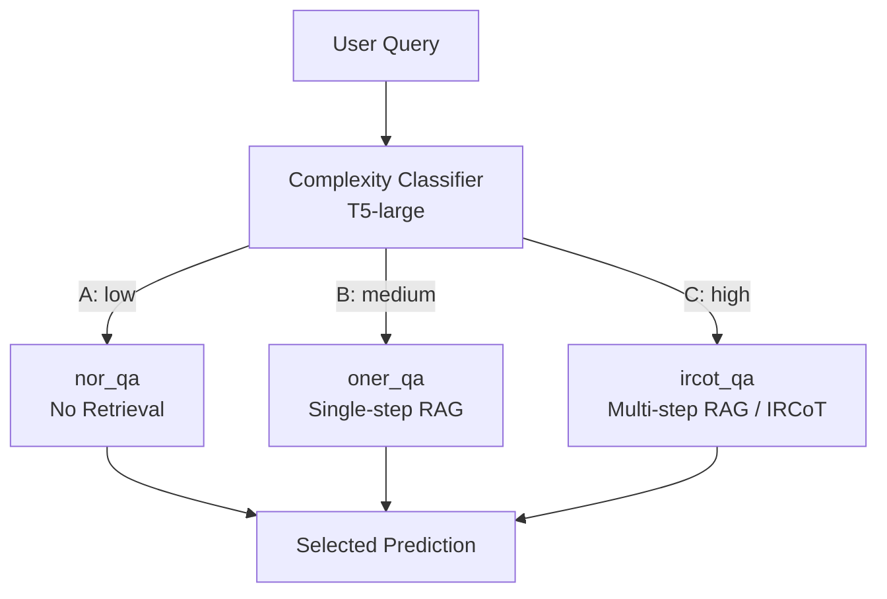
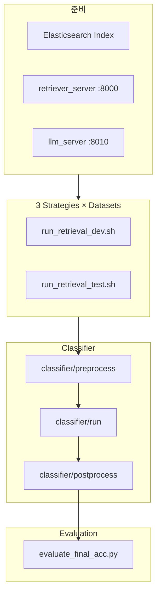

# 02. 아키텍처 — Adaptive-RAG vs Naive RAG

## 1. Naive RAG (단일 전략)

**특징**

- 모든 질문에 **동일한 retrieval depth** 적용
- 구현은 단순하나, 질문 복잡도 분포가 섞인 실제 QA에서는 비효율적

| 변형 | 동작 | 한계 |
|------|------|------|
| Zero-shot (no RAG) | LLM만 | multi-hop 실패 |
| Single-step RAG | 1회 검색 | 복잡 질문 부족 |
| Multi-step RAG (e.g. IRCoT) | 반복 검색·추론 | 단순 질문에 과잉 비용 |

## 2. Adaptive-RAG (제안 구조)

**핵심:** inference 시 **한 가지 전략만 실행**하는 것이 아니라, offline 단계에서 세 전략 모두 dev/test에 대해 실행·저장한 뒤, 분류기 라벨로 **최종 prediction을 merge**합니다 (`classifier/postprocess/`).

## 3. Offline 파이프라인 (upstream 기준)

### 단계별 역할

| 단계 | 컴포넌트 | 역할 |
|------|----------|------|
| Index | `retriever_server/build_index.py` | BM25용 Elasticsearch 인덱스 구축 |
| Retrieve | `retriever_server/` (FastAPI) | 질의별 passage retrieval |
| Generate | `llm_server/` (FastAPI) | FLAN-T5 등 LLM inference |
| Orchestrate | `runner.py` → `run.py` | config 생성, predict, evaluate |
| Classify | `classifier/` | 복잡도 예측 및 prediction routing |
| Score | `evaluate_final_acc.py` | 최종 QA EM/F1 |

## 4. 세 가지 QA 시스템 (upstream naming)

| `SYSTEM` | 논문 전략 | Retrieval | 추론 |
|----------|-----------|-----------|------|
| `nor_qa` | No retrieval | 없음 | LLM 직접 답변 |
| `oner_qa` | Single-step | 1회 (BM25 top-k) | 1-pass QA |
| `ircot_qa` | Multi-step | 반복 (IRCoT) | chain-of-thought + intermediate retrieval |

설정 파일: `base_configs/`, 프롬프트: `prompts/{dataset}/`

## 5. Naive RAG와의 비교표

| 관점 | Naive RAG | Adaptive-RAG |
|------|-----------|--------------|
| 전략 선택 | 고정 1개 | 질문별 3-way 중 1개 |
| 비용 | 항상 최대 또는 최소로 치우침 | 복잡도에 비례 |
| 학습 추가 | 없음 (RAG만) | T5-large complexity classifier |
| 라벨 | — | silver (모델 출력) + binary (데이터셋 bias) |
| 서버 구성 | Retriever + LLM | 동일 + classifier training/eval |

## 6. Adaptive retrieval baseline과의 차이 (개념)

논문은 **질문 복잡도를 명시적 클래스(A/B/C)** 로 modeling하고, **세 가지 well-defined RAG pipeline** 중 하나를 선택합니다.  
단순히 “retrieval 할지 말지” 이진 결정을 넘어 **single vs multi-step depth**까지 적응한다는 점이 차별점입니다.

## 7. 코드에서의 merge 지점

`classifier/postprocess/predict_complexity_on_classification_results.py`:

- 분류기 출력 `dict_id_pred_results.json` (query → A/B/C)
- 각 전략별 test prediction JSON (`ircot_qa_*`, `oner_qa_*`, `nor_qa_*`)
- 복잡도에 맞는 prediction file을 선택해 **Adaptive-RAG 최종 prediction** 생성

이후 `evaluate_final_acc.py`로 통합 성능 측정.

## 참고

- upstream overview 이미지: `vendor/Adaptive-RAG/images/adaptiverag.png`
- IRCoT multi-step backbone: [StonyBrookNLP/ircot](https://github.com/StonyBrookNLP/ircot)
