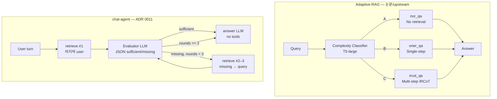

# 05. 논문 Adaptive-RAG vs chat-agent

> **출처:** [Adaptive-RAG (arXiv:2403.14403)](https://arxiv.org/abs/2403.14403) · [starsuzi/Adaptive-RAG](https://github.com/starsuzi/Adaptive-RAG) · [santarosalia/chat-agent](https://github.com/santarosalia/chat-agent)  
> **chat-agent ADR 기준:** [0001](https://github.com/santarosalia/chat-agent/blob/main/docs/adr/0001-contract-a-retrieve-only.md), [0003](https://github.com/santarosalia/chat-agent/blob/main/docs/adr/0003-rag-fallback.md), [0004](https://github.com/santarosalia/chat-agent/blob/main/docs/adr/0004-context-truncate.md), [0008](https://github.com/santarosalia/chat-agent/blob/main/docs/adr/0008-retrieve-query-rewrite.md), [0009](https://github.com/santarosalia/chat-agent/blob/main/docs/adr/0009-langgraph-pipeline.md), [0011](https://github.com/santarosalia/chat-agent/blob/main/docs/adr/0011-retrieve-sufficiency-evaluator.md)

이 문서는 **논문·upstream 실험 코드**와 **프로덕션 지향 chat-agent 구현**을 나란히 놓고 비교하는 스터디 노트입니다. chat-agent는 Adaptive-RAG를 그대로 포팅한 것이 아니라, **“적응형 retrieval depth”** 아이디어를 **온라인 대화 RAG** 맥락에서 재해석한 사례로 봅니다.

## 1. 한 줄 요약

| | Adaptive-RAG (논문) | chat-agent |
|---|---------------------|------------|
| **적응의 축** | 질문 **복잡도** (A/B/C) | 검색 **충분성** (sufficient / missing) |
| **결정 시점** | offline 분류 + inference 시 전략 선택 | 매 턴 retrieve 후 **별도 평가기 LLM** |
| **retrieval depth** | no / single / multi 중 **하나** | **항상 1회 시드** + 부족 시 최대 **2회 추가** (상한 3) |
| **답변 LLM** | 전략별 파이프라인 내부 | **항상 chat-agent 소유**, retrieve 도구 없음 |

## 2. 제어 흐름 비교

## 3. 비교표 (상세)

| 관점 | Adaptive-RAG (논문 · `vendor/Adaptive-RAG/`) | chat-agent ([repo](https://github.com/santarosalia/chat-agent)) |
|------|-----------------------------------------------|-------------------------------------------------------------------|
| **목적** | open-domain QA 벤치마크에서 accuracy–efficiency 균형 | 멀티턴 채팅 + hybrid RAG 연동 ([ADR 0001](https://github.com/santarosalia/chat-agent/blob/main/docs/adr/0001-contract-a-retrieve-only.md): `POST /v1/retrieve`만) |
| **적응 메커니즘** | T5-large **complexity classifier** → A/B/C | **충분성 평가기 LLM** → `{ sufficient, missing[], confidence }` ([ADR 0011](https://github.com/santarosalia/chat-agent/blob/main/docs/adr/0011-retrieve-sufficiency-evaluator.md)) |
| **전략 공간** | **3-way:** no retrieval / single / multi (IRCoT) | **2-phase loop:** 시드 retrieve + 부족 시 재검색 (multi-step IR **개념**에 가깝지만 IRCoT와 동일 알고리즘은 아님) |
| **매 턴 retrieve** | 분류 결과에 따라 **0~N step** (전략마다 다름) | **인사 턴 포함 최소 1회** 시드 retrieve ([ADR 0011](https://github.com/santarosalia/chat-agent/blob/main/docs/adr/0011-retrieve-sufficiency-evaluator.md)) |
| **라운드 카운트** | IRCoT step 수 등 전략별 | 그래프 state **`searchHistory.length`** — 전용 `iteration` 필드 없음 ([ADR 0009](https://github.com/santarosalia/chat-agent/blob/main/docs/adr/0009-langgraph-pipeline.md), [0011](https://github.com/santarosalia/chat-agent/blob/main/docs/adr/0011-retrieve-sufficiency-evaluator.md)) |
| **retrieve 상한** | config·전략 의존 (multi는 IRCoT까지) | **최대 3회.** `searchHistory.length >= 3`이면 evaluate에서 **`answer`로 분기** ([ADR 0011](https://github.com/santarosalia/chat-agent/blob/main/docs/adr/0011-retrieve-sufficiency-evaluator.md)) |
| **`top_k` 스케줄** | 데이터셋·`base_configs/` | **5 → 10 → 20** (1·2·3회차). 요청 `top_k`는 스케줄을 **override하지 않음** ([ADR 0011](https://github.com/santarosalia/chat-agent/blob/main/docs/adr/0011-retrieve-sufficiency-evaluator.md)) |
| **쿼리 구성** | 데이터셋 질문 그대로 (+ IRCoT 중간 쿼리) | **1회:** 뒤에서 가장 가까운 **user 원문**. **2회 이후:** 직전 `missing`을 **공백으로 join**. `missing`이 비면 그 user로 재검색 ([ADR 0011](https://github.com/santarosalia/chat-agent/blob/main/docs/adr/0011-retrieve-sufficiency-evaluator.md)) |
| **쿼리 리라이트 (대화)** | 해당 없음 (단일 QA 질문) | [ADR 0008](https://github.com/santarosalia/chat-agent/blob/main/docs/adr/0008-retrieve-query-rewrite.md)은 **Superseded** — 현재 파이프라인은 ADR 0011의 user/missing 규칙 ([07-query-adaptation.md](07-query-adaptation.md) 참고) |
| **`prepare` 노드** | — | **시스템 프롬프트 + truncate만.** retrieve 하지 않음 ([ADR 0009](https://github.com/santarosalia/chat-agent/blob/main/docs/adr/0009-langgraph-pipeline.md)) |
| **컨텍스트 truncate** | — | LLM 입력 **N=20 메시지**, system + 최신 user always-keep ([ADR 0004](https://github.com/santarosalia/chat-agent/blob/main/docs/adr/0004-context-truncate.md)) |
| **citations** | passage id / support metric | 라운드마다 **누적·중복 제거**. 답변 LLM은 `[Retrieved context]`만 근거 ([ADR 0011](https://github.com/santarosalia/chat-agent/blob/main/docs/adr/0011-retrieve-sufficiency-evaluator.md)) |
| **답변 LLM 도구** | 전략 파이프라인 내부 | **retrieve 도구 없음** — 추가 검색은 평가기+그래프 루프만 ([ADR 0011](https://github.com/santarosalia/chat-agent/blob/main/docs/adr/0011-retrieve-sufficiency-evaluator.md)) |
| **RAG 실패** | 실험 설정 의존 | 5초 타임아웃, 재시도 없음, 실패 시 **RAG skip** + `rag_used: false` ([ADR 0003](https://github.com/santarosalia/chat-agent/blob/main/docs/adr/0003-rag-fallback.md)) |
| **루프 안전망** | — | LangGraph `recursionLimit`(기본 25)은 **무한 루프 방지**일 뿐, **3회 상한을 대체하지 않음** ([ADR 0009](https://github.com/santarosalia/chat-agent/blob/main/docs/adr/0009-langgraph-pipeline.md), [0011](https://github.com/santarosalia/chat-agent/blob/main/docs/adr/0011-retrieve-sufficiency-evaluator.md)) |
| **오케스트레이션** | `run.py`, `commaqa/`, shell grid | **LangGraph** `load_history → prepare → retrieve → evaluate → answer` ([ADR 0009](https://github.com/santarosalia/chat-agent/blob/main/docs/adr/0009-langgraph-pipeline.md)) |
| **state 이력** | prediction JSON 파일 | **`searchHistory`**, **`evaluationHistory`** (클라이언트 응답에는 미포함) ([ADR 0011](https://github.com/santarosalia/chat-agent/blob/main/docs/adr/0011-retrieve-sufficiency-evaluator.md)) |
| **학습 데이터** | silver + binary labels, T5 fine-tune | **별도 분류기 학습 없음** — 평가기는 같은 vLLM 엔드포인트, temperature 0 |
| **평가기 실패** | — | JSON 파싱/호출 실패 → **`sufficient: false`** 로 간주, 다음 라운드 ([ADR 0011](https://github.com/santarosalia/chat-agent/blob/main/docs/adr/0011-retrieve-sufficiency-evaluator.md)) |

## 4. 개념적 대응 (multi-step IR)

논문의 **C (high) → `ircot_qa`** 는 IRCoT로 **여러 번 검색·추론**합니다. chat-agent는 **고정 complexity class 없이**, 평가기가 “아직 부족한 정보(`missing`)”를 명시하면 **그 문자열로 다시 retrieve**합니다. 둘 다 **“한 번의 검색으로 부족하면 더 깊게 간다”** 는 Adaptive-RAG의 multi-step 쪽과 **개념적으로** 맞닿지만:

- 논문: **사전에** 복잡도를 예측해 multi 파이프라인 **전체**를 선택
- chat-agent: **사후에** 충분성을 판단해 **최대 3회**까지 검색만 반복, 추론·답변은 마지막 **단일 answer LLM**

## 5. Contract A (retrieve-only)와 논문 RAG

chat-agent는 RAG의 **`POST /v1/retrieve`만** 호출하고, 최종 답변 LLM은 항상 chat-agent가 실행합니다 ([ADR 0001](https://github.com/santarosalia/chat-agent/blob/main/docs/adr/0001-contract-a-retrieve-only.md)). 논문 upstream도 retriever + LLM server가 분리되어 있으나, **세 가지 QA 시스템**(`nor_qa` / `oner_qa` / `ircot_qa`)이 **서로 다른 inference graph**입니다. chat-agent는 **하나의 그래프** 안에서 depth만 적응합니다.

## 6. 스터디 질문 (자가 점검)

1. 단순 인사 턴에도 chat-agent가 retrieve하는 이유는? → [ADR 0011](https://github.com/santarosalia/chat-agent/blob/main/docs/adr/0011-retrieve-sufficiency-evaluator.md) “인사 턴에도 최소 1회 retrieve”
2. `recursionLimit=25`인데 왜 최대 3회만 도는가? → 비즈니스 상한은 **`searchHistory.length >= 3` 분기**
3. 논문에서 “no retrieval”에 해당하는 경로가 chat-agent에 있는가? → **없음** (실패 시 RAG skip은 [ADR 0003](https://github.com/santarosalia/chat-agent/blob/main/docs/adr/0003-rag-fallback.md)의 **장애 폴백**)

## 다음 읽을 문서

- [06-langgraph-pipeline.md](06-langgraph-pipeline.md) — 노드별 동작·mermaid
- [07-query-adaptation.md](07-query-adaptation.md) — 쿼리 적응과 ADR 0008 → 0011 변천
- [02-architecture.md](02-architecture.md) — upstream Adaptive-RAG 구조
