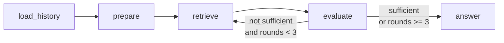

# 06. chat-agent LangGraph 파이프라인

> **출처:** [santarosalia/chat-agent](https://github.com/santarosalia/chat-agent) · [ADR 0009](https://github.com/santarosalia/chat-agent/blob/main/docs/adr/0009-langgraph-pipeline.md) · [ADR 0011](https://github.com/santarosalia/chat-agent/blob/main/docs/adr/0011-retrieve-sufficiency-evaluator.md)  
> **개념 연결:** [Adaptive-RAG multi-step (IRCoT)](https://arxiv.org/abs/2403.14403) — [02-architecture.md](02-architecture.md)

chat-agent는 채팅 RAG 오케스트레이션을 **LangGraph**가 소유합니다 ([ADR 0009](https://github.com/santarosalia/chat-agent/blob/main/docs/adr/0009-langgraph-pipeline.md)). JSON/SSE HTTP 경로는 같은 compiled graph를 `invoke`할 뿐, 파이프라인을 나누지 않습니다.

## 1. 그래프 한눈에 보기

**노드 순서 (고정 엔트리):**  
`load_history → prepare → retrieve → evaluate → (조건부 루프) → answer`

| 노드 | 한 줄 역할 |
|------|------------|
| `load_history` | `session_id` 있으면 DB 대화 + 이번 user, 없으면 요청 `messages` |
| `prepare` | 답변 system 프롬프트 prepend + LLM 입력 **20메시지 truncate** ([ADR 0004](https://github.com/santarosalia/chat-agent/blob/main/docs/adr/0004-context-truncate.md)). **검색 없음** |
| `retrieve` | RAG `POST /v1/retrieve`. citations 누적. `top_k` 스케줄 5→10→20 |
| `evaluate` | 별도 **평가기 LLM** JSON. 충분하면 `answer`, 아니면 `retrieve` ([ADR 0011](https://github.com/santarosalia/chat-agent/blob/main/docs/adr/0011-retrieve-sufficiency-evaluator.md)) |
| `answer` | `[Retrieved context]`를 system에 붙이고 **답변 LLM** (도구 없음, stream 가능) |

## 2. 조건 분기 (evaluate 이후)

evaluate 노드 다음 routing ([ADR 0011](https://github.com/santarosalia/chat-agent/blob/main/docs/adr/0011-retrieve-sufficiency-evaluator.md)):

| 조건 | 다음 노드 |
|------|-----------|
| `sufficient === true` | `answer` |
| `sufficient === false` **且** `searchHistory.length < 3` | `retrieve` (다음 라운드) |
| `searchHistory.length >= 3` | `answer` (부족해도 그때까지의 citations로 답) |

**라운드 번호:** 전용 `iteration` 필드가 아니라 **`searchHistory.length`**. retrieve가 한 번 실행될 때마다 `searchHistory`에 한 줄 추가 ([ADR 0009](https://github.com/santarosalia/chat-agent/blob/main/docs/adr/0009-langgraph-pipeline.md)).

**LangGraph `recursionLimit`:** 기본 25. 무한 루프 **안전망**이며, **3회 retrieve 상한을 대체하지 않음** ([ADR 0009](https://github.com/santarosalia/chat-agent/blob/main/docs/adr/0009-langgraph-pipeline.md), [0011](https://github.com/santarosalia/chat-agent/blob/main/docs/adr/0011-retrieve-sufficiency-evaluator.md)).

## 3. 그래프 state (retrieve 루프 관련)

클라이언트 응답에는 실리지 않지만, 그래프 state에 라운드마다 쌓입니다 ([ADR 0011](https://github.com/santarosalia/chat-agent/blob/main/docs/adr/0011-retrieve-sufficiency-evaluator.md)):

| 필드 | 용도 |
|------|------|
| `searchHistory` | 각 retrieve 라운드의 query, `top_k`, citations 스냅샷 등. **길이 = 현재 라운드 수** |
| `evaluationHistory` | 평가기 출력(`sufficient`, `missing`, `confidence`) 이력 — 다음 evaluate 입력 |

평가기 실패·JSON 파싱 실패는 **`sufficient: false`** 로 처리해 다음 retrieve로 진행합니다.

## 4. retrieve 노드 상세

### 4.1 Contract A

RAG **`POST /v1/retrieve`만** 호출. `/v1/query` 위임 없음 ([ADR 0001](https://github.com/santarosalia/chat-agent/blob/main/docs/adr/0001-contract-a-retrieve-only.md)).

### 4.2 쿼리 규칙

| 라운드 | `query` |
|--------|---------|
| 1회 (시드) | 대화에서 **뒤에서 가장 가까운 user** 원문 |
| 2회 이후 | 직전 evaluate의 **`missing` 배열을 공백으로 join**. 비어 있으면 다시 그 user 원문 |

→ [07-query-adaptation.md](07-query-adaptation.md)

### 4.3 `top_k` 스케줄

| `searchHistory.length` (이번 retrieve 직전) | `top_k` |
|---------------------------------------------|---------|
| 0 (첫 retrieve) | 5 |
| 1 | 10 |
| 2 | 20 |

요청 body의 `top_k`는 이 스케줄을 **override하지 않음** ([ADR 0011](https://github.com/santarosalia/chat-agent/blob/main/docs/adr/0011-retrieve-sufficiency-evaluator.md)).

### 4.4 citations

라운드 결과를 **누적·중복 제거**. answer 노드는 누적분을 `[Retrieved context]`로 system에 주입.

### 4.5 RAG 실패 ([ADR 0003](https://github.com/santarosalia/chat-agent/blob/main/docs/adr/0003-rag-fallback.md))

5초 타임아웃, 재시도 없음. 빈 citations / 타임아웃 / 4xx·5xx → RAG skip, LLM-only (`rag_used: false`).

## 5. prepare vs answer

| | `prepare` | `answer` |
|---|-----------|----------|
| 시점 | 그래프 **앞** (retrieve 전) | evaluate 통과 **후** |
| 역할 | system + **대화 truncate** (N=20) | `[Retrieved context]` + truncate된 messages로 **생성** |
| retrieve | **하지 않음** | **하지 않음** (도구 없음) |

retrieve 결과는 prepare truncate 대상이 **아님** — answer 직전 system inject ([ADR 0004](https://github.com/santarosalia/chat-agent/blob/main/docs/adr/0004-context-truncate.md)).

## 6. HTTP·개발 도구

| 경로 | 동작 |
|------|------|
| `POST /chat/stream` | 같은 graph `invoke` + 답변 LLM `stream()` → SSE |
| `POST /chat` | 같은 graph `invoke` → JSON |
| `GET /dev/graph` | 컴파일된 그래프 **mermaid dump** (`NODE_ENV=production`이면 404) ([ADR 0009](https://github.com/santarosalia/chat-agent/blob/main/docs/adr/0009-langgraph-pipeline.md)) |

`ChatService`는 409/410 검사, SSE 매핑, abort, 성공 시 history append 등 **HTTP 어댑터** 역할만 합니다.

## 7. Adaptive-RAG multi-step IR과의 개념 매핑

| Adaptive-RAG (`ircot_qa`) | chat-agent LangGraph |
|---------------------------|----------------------|
| IRCoT: 추론 단계마다 **새 검색 쿼리** 생성 | evaluate **`missing`** 이 다음 retrieve **query** |
| complexity **C**일 때만 multi 파이프라인 | **매 턴** 시드 retrieve + 필요 시 루프 (복잡도 class 없음) |
| step 수는 IRCoT 설정·질문에 따라 가변 | retrieve **상한 3**, `top_k` 5→10→20 |
| 최종 답변은 multi-step graph 내부 | **단일 `answer` LLM** (충분성 판단과 분리) |

논문 파이프라인은 [02-architecture.md](02-architecture.md), chat-agent vs 논문 전체 비교는 [05-paper-vs-chat-agent.md](05-paper-vs-chat-agent.md)를 참고하세요.

## 8. ADR 변천 (그래프가 이렇게 된 이유)

| ADR | 내용 | 현재 |
|-----|------|------|
| [0009](https://github.com/santarosalia/chat-agent/blob/main/docs/adr/0009-langgraph-pipeline.md) | LangGraph가 파이프라인 소유 | **Accepted** — 노드 표는 0011 기준으로 갱신됨 |
| [0010](https://github.com/santarosalia/chat-agent/blob/main/docs/adr/0010-retrieve-as-answer-tool.md) | 답변 LLM retrieve 도구 | **Superseded by 0011** |
| [0011](https://github.com/santarosalia/chat-agent/blob/main/docs/adr/0011-retrieve-sufficiency-evaluator.md) | 별도 평가기 + retrieve 루프 | **Accepted** — 현재 그래프 |

## 다음 읽을 문서

- [05-paper-vs-chat-agent.md](05-paper-vs-chat-agent.md)
- [07-query-adaptation.md](07-query-adaptation.md)
