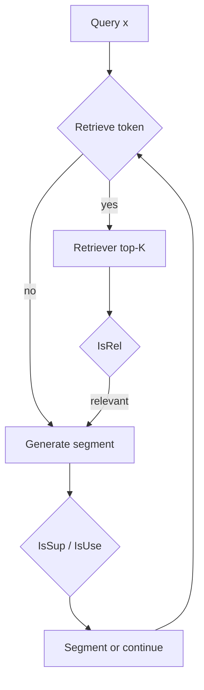

# 08. Self-RAG — 요약 및 Adaptive-RAG · chat-agent와의 비교

> **출처:** [arXiv:2310.11511](https://arxiv.org/abs/2310.11511) · ICLR 2024  
> **공식 코드:** [AkariAsai/self-rag](https://github.com/AkariAsai/self-rag) · [selfrag.github.io](https://selfrag.github.io/)

## 1. 문제 정의 (Problem)

표준 RAG는 **고정 횟수·고정 시점**에 passage를 검색해 LLM에 주입합니다. 그러나:

- retrieval이 **불필요한** 질문에도 검색하면 비용·노이즈가 늘고
- passage가 **관련 없거나** 생성이 **근거 없이** 이어지면 품질이 떨어집니다.

Self-RAG(Self-Reflective Retrieval-Augmented Generation)는 **한 LM**이 retrieval 필요 여부, passage 관련성, 생성의 근거성, 전체 유용성을 **스스로 판단(reflection)** 하도록 학습해, inference 시 **on-demand adaptive retrieval**과 **critique 기반 제어**를 가능하게 합니다.

## 2. 핵심 아이디어

### 2.1 Reflection tokens (비평 토큰)

LM vocabulary를 확장해, 생성 중 특수 **reflection token**을 디코딩합니다. 논문·공식 구현에서 대표 타입은 다음과 같습니다.

| 타입 | 입력 | 출력 | 역할 |
|------|------|------|------|
| **Retrieve** | 질문 `x` (및 이전 생성) | `{yes, no, continue}` | **언제** 검색할지 (continue = 이전 evidence 재사용) |
| **IsRel** | `x`, passage `d` | `{relevant, irrelevant}` | passage가 질문 해결에 **유용한지** |
| **IsSup** | `x`, `d`, 생성 `y` | `{fully supported, partially supported, no support}` | 생성이 passage로 **뒷받침되는지** |
| **IsUse** | `x`, `y` | `{5, 4, 3, 2, 1}` | 응답 **전체 유용성** |

이 토큰들은 **inference 시 제어 신호**로 쓰입니다 (예: factual QA에서는 retrieval 빈도를 높이고, 개방형 글쓰기에서는 낮춤).

### 2.2 Adaptive retrieve on-demand

- **Retrieve** 토큰으로 세그먼트마다 검색 여부를 결정합니다.
- **한 번도 검색하지 않거나**, **여러 번 검색**하거나, **continue**로 기존 evidence를 재사용할 수 있습니다.
- 대안: `Retrieve=Yes` 확률이 **threshold**를 넘으면 검색 트리거 (공식 repo: `adaptive_retrieval`, `threshold` 파라미터).

### 2.3 Critique 기반 생성 (segment-level beam search)

- passage 후보·생성 후보에 대해 **IsRel / IsSup / IsUse** 점수를 beam search critic score에 가중 합산 (`w_rel`, `w_sup`, `w_use`).
- **Critic 모델**과 **Generator 모델**을 각각 reflection token 포함 데이터로 학습 (둘 다 next-token prediction).

## 3. 학습·실험 (개요)

- **학습 데이터:** Critic이 segment마다 retrieval/critique 라벨을 붙여, inference 과정을 모방한 supervised data 생성.
- **평가:** open-domain QA, reasoning, fact verification, long-form generation 등 다양한 task.
- **모델 규모:** 논문은 7B·13B Self-RAG LM을 보고하며, ChatGPT·retrieval-augmented Llama2-chat 등과 비교합니다.

> **주의:** EM/F1, task별 정확도 등 **구체적 수치는 논문 표·그래프를 직접 인용**하세요.  
> 이 스터디 문서는 수치를 임의로 기재하지 않습니다.

## 4. Adaptive-RAG와의 비교

| 관점 | Adaptive-RAG ([2403.14403](https://arxiv.org/abs/2403.14403)) | Self-RAG ([2310.11511](https://arxiv.org/abs/2310.11511)) |
|------|---------------------------------------------------------------|-----------------------------------------------------------|
| **적응의 축** | 질문 **복잡도** (A/B/C) → 전략 선택 | **세그먼트 단위** retrieval 필요·passage 품질·생성 품질 |
| **결정 주체** | **외부** T5-large classifier | **동일 LM** 내부 reflection token |
| **retrieval depth** | no / single / **multi (IRCoT)** 중 **하나** | 0~N회 **on-demand** (생성 중간에도 가능) |
| **critique** | 분류기는 **전략 라벨**만 예측 | **IsRel / IsSup / IsUse** 다층 self-critique |
| **학습** | silver + binary label로 **분류기** fine-tune | critic + generator **LM** fine-tune (토큰 확장) |
| **plug-and-play** | 기존 3 QA pipeline + merge | 임의 LM + retriever; CRAG 등과 **결합** 가능 ([09-crag.md](09-crag.md)) |
| **효율 관점** | 사전 complexity로 **불필요한 multi-step 회피** | **Retrieve=no**로 검색 생략 가능 |

**공통점:** 둘 다 “모든 질문에 동일 RAG”를 피하고 **적응형 retrieval**을 목표로 합니다.  
**차이:** Adaptive-RAG는 **질문 진입 시점**에 coarse routing; Self-RAG는 **생성 과정 전반**에 fine-grained self-reflection.

## 5. chat-agent와의 비교

| 관점 | Self-RAG | chat-agent ([ADR 0011](https://github.com/santarosalia/chat-agent/blob/main/docs/adr/0011-retrieve-sufficiency-evaluator.md)) |
|------|----------|-----------------------------------------------------------------------------------------------------------------------------------|
| **언제 retrieve** | LM이 **Retrieve** 토큰 (또는 threshold) | **매 턴 최소 1회** 시드 retrieve 후, 평가기가 `sufficient` 판단 |
| **검색 생략** | 가능 (`no_retrieval` 모드) | **없음** (RAG 장애 시 skip은 [ADR 0003](https://github.com/santarosalia/chat-agent/blob/main/docs/adr/0003-rag-fallback.md) 폴백) |
| **critique 형태** | 학습된 **reflection token** (IsRel, IsSup, IsUse) | 별도 **평가기 LLM** JSON `{ sufficient, missing[], confidence }` |
| **다음 쿼리** | retriever + 이전 생성 context | **`missing` join** ([07-query-adaptation.md](07-query-adaptation.md)) |
| **depth 상한** | `max_depth` (공식 repo 기본 6) | **`searchHistory.length >= 3`** |
| **답변 LLM** | Self-RAG LM이 passage critique와 함께 생성 | **answer LLM**은 retrieve 도구 없음; depth는 그래프 루프 |
| **학습** | critic/generator **fine-tune 필요** | 평가기는 **prompting** (동일 vLLM, temperature 0) |

**개념적 유사:** Self-RAG의 **Retrieve on-demand** + passage/생성 critique ↔ chat-agent의 **충분성 평가 + 재검색**은 “검색 결과·생성 품질을 보고 다음 행동을 정한다”는 점에서 가깝습니다.

**구현 차이:** chat-agent는 reflection token **없이** orchestration layer(LangGraph + JSON evaluator)로 분리했고, **대화 턴·Contract A** 제약 하에서 동작합니다 ([05-paper-vs-chat-agent.md](05-paper-vs-chat-agent.md)).

## 6. 스터디 질문 (자가 점검)

1. Self-RAG에서 **continue** 토큰의 의미는? → 이미 확보된 evidence로 **추가 검색 없이** 생성 지속.
2. Adaptive-RAG **C → ircot_qa**와 Self-RAG **multi Retrieve**의 차이는? → 전자는 **사전** multi pipeline 선택, 후자는 **생성 중** adaptive.
3. chat-agent 평가기의 `missing`은 Self-RAG의 어떤 신호에 대응할까? → **부족한 정보 facet** 명시 (IsSup/IsRel의 structured orchestration 버전에 가깝게 해석 가능).

## 다음 읽을 문서

- [09-crag.md](09-crag.md) — retrieval **품질 보정** (Self-RAG와 evaluator 공유 맥락)
- [10-iter-retgen.md](10-iter-retgen.md) — generation으로 retrieval 쿼리를 **풍부화**
- [11-adaptive-rag-family-comparison.md](11-adaptive-rag-family-comparison.md) — 계열 통합 비교표
- [05-paper-vs-chat-agent.md](05-paper-vs-chat-agent.md) — Adaptive-RAG vs chat-agent
