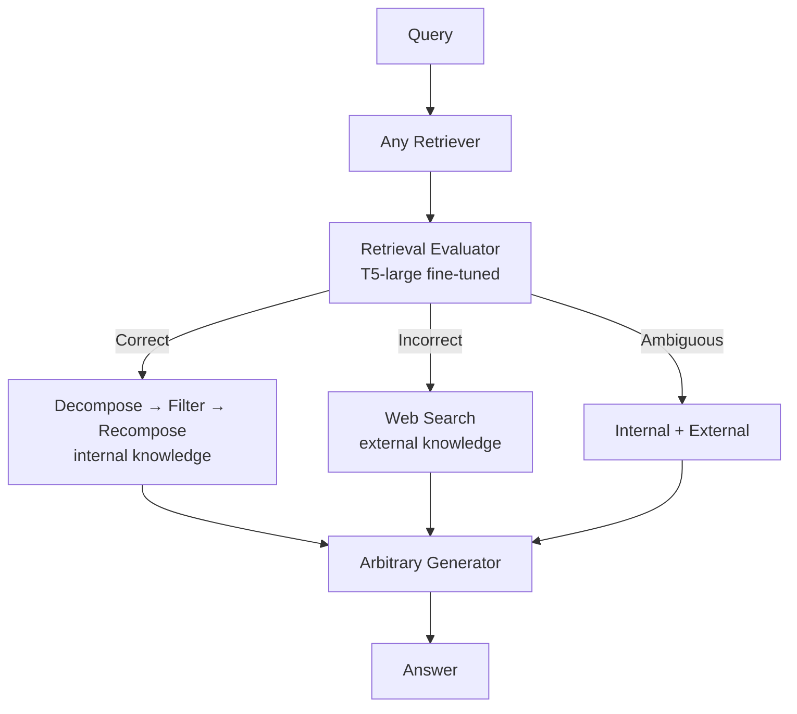

# 09. CRAG — 요약 및 Adaptive-RAG · chat-agent와의 비교

> **출처:** [arXiv:2401.15884](https://arxiv.org/abs/2401.15884)  
> **공식 코드:** [HuskyInSalt/CRAG](https://github.com/HuskyInSalt/CRAG)

## 1. 문제 정의 (Problem)

RAG는 retriever가 **관련 없거나 오래된** 문서를 반환하면, LLM이 **잘못된 근거** 위에서 hallucination을 일으킬 수 있습니다. CRAG(Corrective Retrieval Augmented Generation)는 **retrieval 결과를 먼저 평가·보정**한 뒤 생성에 넘겨, RAG의 **견고성(robustness)** 을 높이는 **plug-and-play** 모듈입니다.

핵심 가설: “검색이 틀렸을 때 어떻게 행동할 것인가?”에 대한 **명시적 corrective action**이 필요하다.

## 2. 파이프라인 개요

입력: 임의 retriever의 top documents + query.  
출력: **보정된 knowledge strips**를 generator에 전달 (표준 RAG·Self-RAG 위에 **끼워 넣기** 가능).

## 3. Retrieval Evaluator

- **모델:** T5-large 초기화 후 fine-tune (경량, LLM 대비 작음).
- **역할:** query–document **관련성 점수**를 산출 (inference 시 대략 **−1 ~ 1**).
- **학습 신호:** Self-RAG ([2310.11511](https://arxiv.org/abs/2310.11511))가 제공한 PopQA relevance 라벨 등 활용; 논문은 동일 Contriever retrieval 결과로 Self-RAG와 **공정 비교**합니다.
- **문서 단위:** retrieved document **각각** 점수 → confidence에 따라 action 분기.

### 3.1 세 가지 corrective action

| Action | 트리거 (개념) | 동작 |
|--------|---------------|------|
| **Correct** | 최소 하나의 document confidence가 **상한 threshold** 초과 | 해당 문서를 **decompose-then-recompose**로 정제 |
| **Incorrect** | **모든** document confidence가 **하한 threshold** 미만 | corpus retrieval **폐기** → **web search**로 대체 |
| **Ambiguous** | 그 외 (중간 confidence) | **Correct 처리 knowledge + Incorrect 처리 knowledge** 병합 |

논문은 **Ambiguous**가 evaluator 오판에 대한 **완충** 역할을 한다고 강조합니다 (Correct/Incorrect만 쓰면 evaluator 정확도에 과의존).

> threshold는 데이터셋별로 **경험적 설정** (논문 Appendix: PopQA `(0.59, -0.99)` 등).  
> 스터디 노트에서는 **임의 수치를 표에 재기재하지 않습니다** — 필요 시 논문 Appendix B.3을 참조하세요.

## 4. Decompose-then-Recompose (지식 정제)

**Correct** action에서:

1. **Decompose:** retrieved document를 **knowledge strip**(짧은 문장 단위)으로 분할.
2. **Filter:** 동일 retrieval evaluator로 strip별 relevance 점수 → irrelevant strip 제거.
3. **Recompose:** relevant strip을 순서대로 **concat** → **internal knowledge**.

**Incorrect** action의 **web search:**

- Google Search API 등으로 URL 검색 (논문 구현).
- HTML paragraph 단위 선택 후 evaluator로 **external knowledge** 필터링.
- query **keyword rewriting**으로 검색 품질 보조 (ablation에서 기여 확인).

## 5. 실험·결합 (개요)

- **데이터셋 (4개):** PopQA (short-form), Biography (long-form, FactScore), PubHealth, Arc-Challenge.
- **결합:** 표준 RAG → **CRAG**; Self-RAG → **Self-CRAG** (Self-RAG의 retrieved item을 CRAG 보정 knowledge로 교체).
- **주장 (abstract):** short/long-form 포함 다양한 task에서 RAG·Self-RAG 대비 **유의미한 개선**; plug-and-play.

> **주의:** Table 1의 Acc/FactScore 향상 **%** 등은 논문 본문 표를 직접 인용하세요. 여기서는 재인용하지 않습니다.

## 6. Adaptive-RAG와의 비교

| 관점 | Adaptive-RAG ([2403.14403](https://arxiv.org/abs/2403.14403)) | CRAG ([2401.15884](https://arxiv.org/abs/2401.15884)) |
|------|---------------------------------------------------------------|--------------------------------------------------------|
| **적응 목표** | **얼마나 깊게** retrieve할지 (no/single/multi) | **가져온 문서가 쓸 만한지** + 틀리면 **어떻게 고칠지** |
| **evaluator 역할** | query **complexity** (A/B/C) | document **relevance confidence** → Correct/Incorrect/Ambiguous |
| **evaluator 모델** | T5-large **classifier** | T5-large **retrieval evaluator** (점수 연속) |
| **retrieval source** | 고정 corpus (BM25/ES) | corpus + **web search fallback** |
| **multi-step** | IRCoT **multi-hop** | 반복 hop보다 **품질 보정·지식 strip** 중심 |
| **학습** | complexity silver/binary labels | relevance ±1 labels (Self-RAG 데이터 활용) |
| **plug-and-play** | 3-way pipeline merge 구조 | **임의 RAG generator** 위에 모듈 삽입 |

**상호 보완 가능성:** Adaptive-RAG는 **전략 routing**, CRAG는 **선택된 retrieval 결과 정제**. 논문은 Self-RAG + CRAG = Self-CRAG로 **계열 결합**을 실험합니다.

## 7. chat-agent와의 비교

| 관점 | CRAG | chat-agent ([ADR 0011](https://github.com/santarosalia/chat-agent/blob/main/docs/adr/0011-retrieve-sufficiency-evaluator.md)) |
|------|------|-----------------------------------------------------------------------------------------------------------------------------------|
| **평가 대상** | **retrieved document** relevance | **누적 citations**가 user 질문에 **충분한지** (`sufficient`) |
| **evaluator** | fine-tuned **T5-large** (별도 모델) | **prompted LLM** JSON evaluator |
| **점수 형태** | 연속 relevance + **3-way action** | boolean + **`missing[]`** facet list |
| **Correct 시** | strip decompose/recompose | (해당 없음) — context **누적** 그대로 answer에 전달 |
| **Incorrect 시** | corpus 폐기 + **web search** | **재검색** (`missing` query, 동일 hybrid RAG API) |
| **Ambiguous** | internal + external **혼합** | `sufficient: false`이면 **추가 retrieve** (최대 3회) |
| **depth 적응** | action별 **지식원 교체** | **라운드 수** + `top_k` 5→10→20 |
| **plug-and-play** | RAG stack **중간 레이어** | **프로덕션 그래프** 일부 (Contract A) |

**개념적 대응:**

- CRAG evaluator ↔ chat-agent **sufficiency evaluator**: 둘 다 “지금 context로 답해도 되는가?”를 **retrieval 이후** 판단.
- CRAG **Incorrect → web** ↔ chat-agent **`missing` → 재retrieve**: 둘 다 **1차 retrieval 실패/부족** 시 **대체 지식원** 탐색.
- 차이: CRAG는 **문서 품질·strip 필터·웹**에 초점; chat-agent는 **대화 턴·missing facet·고정 3라운드**에 초점 ([07-query-adaptation.md](07-query-adaptation.md)).

## 8. Adaptive-RAG classifier vs CRAG vs chat-agent evaluator

| | Adaptive-RAG classifier | CRAG retrieval evaluator | chat-agent sufficiency evaluator |
|---|-------------------------|--------------------------|----------------------------------|
| **시점** | retrieve **전** (routing) | retrieve **직후** (correction) | retrieve **직후** (loop control) |
| **출력** | A/B/C → nor/oner/ircot | Correct / Incorrect / Ambiguous | sufficient + missing |
| **학습** | fine-tune T5 | fine-tune T5 | **없음** (prompt) |
| **실패 시** | 잘못된 전략 선택 | web / mixed knowledge | `sufficient: false` → 재검색 |
| **생성 모델과 분리** | classifier **분리** | evaluator **분리** | evaluator **분리**, answer LLM **분리** |

## 9. 스터디 질문 (자가 점검)

1. CRAG가 **Adaptive-RAG의 complexity routing**을 대체할 수 있는가? → **아니오** — CRAG는 **품질 보정**이지 depth routing이 아님.
2. Self-CRAG에서 CRAG가 Self-RAG의 **어느 단계**를 대체하는가? → Self-RAG가 고른 passage를 **CRAG processed knowledge**로 교체.
3. chat-agent에 CRAG식 **web fallback**이 있는가? → **ADR 0011 기준 없음** — 재검색은 동일 hybrid retrieve API.

## 다음 읽을 문서

- [08-self-rag.md](08-self-rag.md) — Self-RAG · Self-CRAG 맥락
- [10-iter-retgen.md](10-iter-retgen.md) — generation-augmented retrieval
- [11-adaptive-rag-family-comparison.md](11-adaptive-rag-family-comparison.md) — 통합 비교
- [05-paper-vs-chat-agent.md](05-paper-vs-chat-agent.md)
