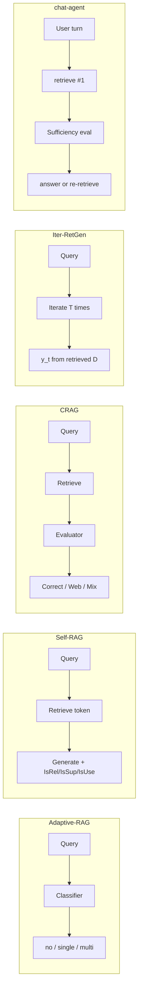

# 11. Adaptive RAG 계열 통합 비교

> **출처:**  
> - Adaptive-RAG: [arXiv:2403.14403](https://arxiv.org/abs/2403.14403)  
> - Self-RAG: [arXiv:2310.11511](https://arxiv.org/abs/2310.11511)  
> - CRAG: [arXiv:2401.15884](https://arxiv.org/abs/2401.15884)  
> - Iter-RetGen: [arXiv:2305.15294](https://arxiv.org/abs/2305.15294)  
> - chat-agent: [santarosalia/chat-agent](https://github.com/santarosalia/chat-agent) · [ADR 0011](https://github.com/santarosalia/chat-agent/blob/main/docs/adr/0011-retrieve-sufficiency-evaluator.md)

이 문서는 스터디 계열 논문과 **프로덕션 chat-agent**를 한 표에서 대조합니다.  
수치·벤치마크 점수는 **각 논문 표**를 참조하세요 (여기서는 재기재하지 않음).

## 1. 마스터 비교표

| 축 | Adaptive-RAG | Self-RAG | CRAG | Iter-RetGen | chat-agent |
|----|--------------|----------|------|-------------|------------|
| **언제 retrieve 하는가** | complexity **A/B/C**로 retrieve **전** no / 1회 / multi 선택 | **Retrieve** reflection token (yes/no/continue) 또는 threshold; 생성 **중** on-demand | **항상 1차 retrieve** 후 evaluator가 action; Incorrect 시 **web** | **매 iteration** (`T`회); 1차는 `q`, 이후 `y_{t-1}\|\|q` | **매 user 턴** 최소 1회 시드; `sufficient: false`이면 추가 (≤3) |
| **depth / 깊이 적응** | **3-way:** nor_qa / oner_qa / ircot_qa | 0~N retrieval; segment beam (`max_depth`) | depth보다 **지식원 교체·strip 정제** | **고정 iteration `T`** (논문 주로 T=2); 점진적 query enrichment | **2-phase loop:** 시드 + missing 기반 재검색; `top_k` 5→10→20 |
| **evaluator / critique** | T5 **complexity classifier** (A/B/C) | **Reflection tokens:** IsRel, IsSup, IsUse (+ Retrieve) | T5 **retrieval evaluator** → Correct / Incorrect / Ambiguous | **없음** (생성물 `y_{t-1}`이 implicit signal) | **Sufficiency evaluator LLM:** `{ sufficient, missing[], confidence }` |
| **training vs prompting** | classifier **fine-tune** (silver+binary); QA pipeline은 config | critic + generator LM **fine-tune** (token 확장) | retrieval evaluator **fine-tune**; generator는 임의 | 주로 **few-shot prompting**; 선택적 retriever **distillation** | evaluator·answer **prompting** (동일 vLLM); **분류기 학습 없음** |
| **plug-and-play** | 3 **별도** inference graph + merge | LM+retriever 교체 가능; CRAG와 **Self-CRAG** 결합 | **임의 RAG/ Self-RAG 위** 모듈 | retriever+LLM **prompt recipe** | **LangGraph** + Contract A retrieve API; 논문 코드와 **별 repo** |
| **chat-agent ADR 0011 관련성** | **사전 routing** vs chat-agent **사후 sufficiency** — multi-step **개념**만 유사 ([05](05-paper-vs-chat-agent.md)) | Retrieve on-demand + critique ↔ **evaluate loop**; token critique vs **JSON evaluator** ([08](08-self-rag.md)) | Document relevance action ↔ **sufficient/missing**; web fallback vs **missing 재retrieve** ([09](09-crag.md)) | `y_{t-1}` query aug ↔ **`missing` join**; 고정 T vs **3-round cap** ([10](10-iter-retgen.md)) | **기준선(baseline)** — sufficiency-driven depth, user/missing 쿼리, answer LLM no-tools |

## 2. 제어 흐름 (축약 mermaid)

## 3. “적응”이 가리키는 것 — 용어 정리

| 방법 | “적응”의 의미 |
|------|----------------|
| **Adaptive-RAG** | 질문 **난이도**에 맞는 **retrieval 전략 개수** |
| **Self-RAG** | **세그먼트**마다 retrieval·passage·생성 **품질** |
| **CRAG** | retrieved **문서 품질**에 맞는 **보정 행동** |
| **Iter-RetGen** | **iteration**마다 생성물 기반 **query 풍부화** |
| **chat-agent** | **턴 내** citations **충분성**에 맞는 **재검색 횟수** |

## 4. chat-agent ADR 0011 관점 체크리스트

[ADR 0011](https://github.com/santarosalia/chat-agent/blob/main/docs/adr/0011-retrieve-sufficiency-evaluator.md) 핵심 요구와의 정렬:

| ADR 0011 요소 | 계열 논문 중 가장 가까운 analog | chat-agent만의 차이 |
|---------------|----------------------------------|---------------------|
| retrieve 후 **sufficient** 판단 | Self-RAG IsSup/IsUse; CRAG evaluator; (Iter-RetGen은 implicit) | **JSON sufficient** + **missing[]** |
| **missing**으로 다음 query | Iter-RetGen `y_{t-1}`; IRCoT 중간 query | **`missing` join** (규칙 고정) |
| retrieve **상한** | Self-RAG `max_depth`; Iter-RetGen `T` | **`searchHistory.length >= 3`** |
| **no retrieval** path | Adaptive-RAG A; Self-RAG Retrieve=no | **없음** (최소 1회 시드) |
| answer LLM **no tools** | Self-RAG/CRAG는 통합 LM 생성 | **그래프가 retrieve 소유** |

## 5. 스터디 로드맵 (읽은 뒤)

1. 본 표에서 **chat-agent에 가장 가까운 논문 2개**를 고르고 이유를 한 문장으로 적기.
2. **Adaptive-RAG C + CRAG**를 상상 결합하면 어느 단계에 CRAG가 들어가는지 그리기 (힌트: ircot retrieve **후** document correction).
3. Self-RAG **Retrieve=no**를 chat-agent에 도입한다면 [ADR 0011](https://github.com/santarosalia/chat-agent/blob/main/docs/adr/0011-retrieve-sufficiency-evaluator.md) “인사 턴 최소 1회 retrieve”와 **어떤 trade-off**가 생기는지 적기.

## 다음 읽을 문서

- [05-paper-vs-chat-agent.md](05-paper-vs-chat-agent.md) — Adaptive-RAG vs chat-agent 상세
- [08-self-rag.md](08-self-rag.md) · [09-crag.md](09-crag.md) · [10-iter-retgen.md](10-iter-retgen.md) — 개별 논문 노트
- [glossary.md](glossary.md) — 용어집
